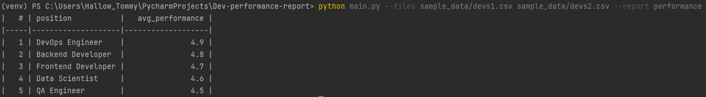

Скрипт для обработки CSV-файлов с данными о закрытых задачах и формирования отчётов по эффективности разработчиков. Основной отчёт — `performance`: список позиций и средняя эффективность (среднее арифметическое по колонке `performance`), отсортированный по эффективности.

Назначение
----------
Программа собирает данные из одного или нескольких CSV-файлов и формирует отчёт(ы) в консоли в виде таблицы. Параметры запуска задаются через CLI: `--files` и `--report`.

Формат входных CSV
------------------
Пример строки CSV (первой строкой идёт заголовок):
name,position,completed_tasks,performance,skills,team,experience_years

Пример данных:
Alex Ivanov,Backend Developer,45,4.8,"Python, Django, PostgreSQL, Docker",API Team,5

Пример запуска
--------------
В корне проекта выполните:

```bash
# пример: заменить `dev_performance_report` на фактический модуль/скрипт при необходимости
python -m dev_performance_report --files data/closed_tasks1.csv data/closed_tasks2.csv --report performance
```

Вывод
-----
Отчёт `performance` выводит для каждой уникальной позиции (position) среднее значение поля `performance` по всем переданным файлам и сортирует строки по значению эффективности (по убыванию или возрастанию — в реализации указывается явно). Для вывода используется табличный формат (например, библиотека `tabulate`) для удобочитаемости.

Добавление нового отчёта
-----------------------
Архитектура сделана так, чтобы легко добавить новые виды отчётов:
- Создайте новую функцию/класс, реализующую логику агрегации данных и рендеринга таблицы.
- Зарегистрируйте новый отчёт в месте выбора отчётов (фабрика/реестр). CLI должен принимать `--report <name>` и выбирать соответствующую реализацию.
- Напишите тесты, покрывающие критическую логику нового отчёта.

Тесты
-----
- Используется pytest.
- Запуск тестов:
```bash
python -m pytest -q
```

<<<<<<< HEAD
